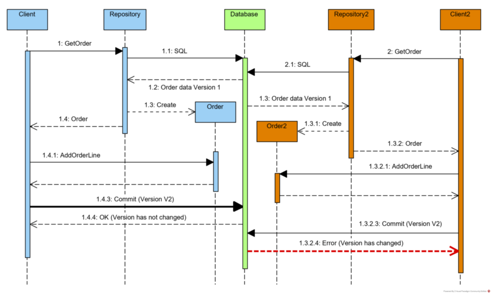

# Concurrency_control

## Status

What is the status, such as proposed, accepted, rejected, deprecated, superseded, etc.?

## Context

What is the issue that we're seeing that is motivating this decision or change?

## Decision

Use optimistic concurrency checks on our aggregates to make sure that operations are acting in a valid way. 

### Optimistic concurrency example

sourced from https://www.kamilgrzybek.com/blog/posts/handling-concurrency-aggregate-pattern-ef-core

## Consequences

Need to add version numbers to aggregates and make sure that these are checked when making changes to them

## Technical explanation

More detailed technical information about the proposed solution (if required)

